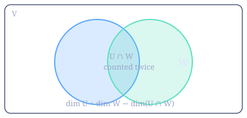

#+TITLE: Linear Algebra I — Vectors, Maps, and Elimination
#+ZEMACS_CURRICULUM: 1

* Contents
- [[id:unit-1][1. Vectors and Spaces]]
- [[id:unit-2][2. Linear Maps and Matrices]]
- [[id:unit-3][3. Gaussian Elimination]]

* Vectors and Spaces
:PROPERTIES:
:ID: unit-1
:END:

A *vector space* over a field $F$ is a set $V$ with an addition and a scalar
multiplication satisfying eight axioms. Rather than memorise the list, notice
what it buys: every statement below is a consequence of those axioms alone, so
it holds for $\mathbb{R}^n$, for polynomials, for functions, and for anything
else that happens to satisfy them. That is the whole reason to work abstractly.

A finite set $\{v_1, \dots, v_k\} \subseteq V$ is *linearly independent* when

\[
  \sum_{i=1}^{k} c_i v_i = 0 \quad\Longrightarrow\quad c_1 = \cdots = c_k = 0
\]

and it *spans* $V$ when every $v \in V$ is some $\sum c_i v_i$. A set that does
both is a *basis*, and the central fact of the subject is that any two bases of
the same space have the same size. That common size is the *dimension*.

The picture to keep is the dimension formula for two subspaces $U, W \le V$:

\[
  \dim(U + W) \;=\; \dim U + \dim W - \dim(U \cap W)
\]

The subtraction is inclusion–exclusion: a vector in the intersection is counted
once by $U$ and once by $W$, so it is paid for twice and refunded once.

** Problem
:PROPERTIES:
:ZEMACS_PROBLEM: written
:ZEMACS_STATUS: todo
:END:

Let $V$ be a vector space with a finite spanning set. Prove that every basis of
$V$ has the same number of elements.

State clearly where you use the *exchange* step — the point at which a vector of
one basis is swapped for a vector of the other — since that is the only place
the finiteness hypothesis does any work.

*** Response

** Problem
:PROPERTIES:
:ZEMACS_PROBLEM: programming
:ZEMACS_PACKAGES: numpy
:ZEMACS_STATUS: todo
:END:

Write ~independent(vectors)~, deciding whether a list of vectors in
$\mathbb{R}^n$ is linearly independent.

Do it by *rank*, not by determinant: the determinant is only defined for a
square matrix, and the question is asked of any number of vectors of any length.
Floating point means "is this rank deficient" is a question about a tolerance,
not about exact zero — say what tolerance you chose and why.

#+begin_src python :tangle independence.py
import numpy as np

def independent(vectors, tol=1e-10):
    """True when `vectors` (a list of 1-D arrays) is linearly independent."""
    ...

if __name__ == "__main__":
    e1, e2 = np.array([1.0, 0.0]), np.array([0.0, 1.0])
    print("basis of R^2:  ", independent([e1, e2]))
    print("with a repeat: ", independent([e1, e2, e1]))
    print("three in R^2:  ", independent([e1, e2, e1 + e2]))
#+end_src

* Linear Maps and Matrices
:PROPERTIES:
:ID: unit-2
:END:

A *linear map* $T : V \to W$ satisfies $T(av + bw) = aT(v) + bT(w)$. Fix a basis
of $V$ and one of $W$ and $T$ becomes a matrix — but the map is the real object
and the matrix is a *description of it in coordinates*. Change either basis and
the matrix changes while the map does not. Almost every confusion in a first
course is this distinction collapsing.

Two subspaces come free with any $T$: the kernel $\ker T = \{v : T(v) = 0\}$ and
the image $\operatorname{im} T = \{T(v) : v \in V\}$. They are related by the
rank–nullity theorem, which is the dimension formula of unit 1 wearing a
different hat:

\[
  \dim \ker T + \dim \operatorname{im} T \;=\; \dim V
\]

Read it as a conservation law. $V$ has $\dim V$ dimensions to spend; every one
the map collapses is a dimension the image does not get.

** Problem
:PROPERTIES:
:ZEMACS_PROBLEM: written
:ZEMACS_STATUS: todo
:END:

Prove the rank–nullity theorem: for $T : V \to W$ with $V$ finite-dimensional,

\[
  \dim \ker T + \operatorname{rank} T = \dim V.
\]

Then explain, in one paragraph and without symbols, why it follows that a linear
map from a space to *itself* is injective exactly when it is surjective — and
why that equivalence fails when $V$ is infinite-dimensional. Give the standard
counterexample.

*** Response

* Gaussian Elimination
:PROPERTIES:
:ID: unit-3
:END:

Elimination is the algorithm behind almost everything computational here:
solving $Ax = b$, inverting, computing rank and determinant. Three row
operations — swap two rows, scale a row, add a multiple of one row to another —
each leave the solution set unchanged, and repeated application drives $A$ to
upper triangular form, which back-substitution then solves in $O(n^2)$.

The subtlety is not the algebra, it is the arithmetic. Dividing by a pivot close
to zero multiplies the error already in the data by roughly $1/|\text{pivot}|$.
*Partial pivoting* — before eliminating in column $k$, swap in the row whose
entry in that column is largest in absolute value — costs a comparison per
column and is the difference between an answer and noise:

\[
  \begin{pmatrix} 10^{-20} & 1 \\ 1 & 1 \end{pmatrix}
  \begin{pmatrix} x_1 \\ x_2 \end{pmatrix}
  = \begin{pmatrix} 1 \\ 2 \end{pmatrix}
\]

has a perfectly ordinary solution near $(1, 1)$, and eliminating without
pivoting returns $x_1 = 0$.

** Problem
:PROPERTIES:
:ZEMACS_PROBLEM: programming
:ZEMACS_PACKAGES: numpy
:ZEMACS_STATUS: todo
:END:

Implement Gaussian elimination with partial pivoting.

~solve(A, b)~ should return $x$ with $Ax = b$, and raise a clear error when $A$
is singular. Do not call ~numpy.linalg.solve~ — that is the thing being written.
Use numpy for arrays and arithmetic only.

The runner below includes the ill-conditioned system from the notes; a correct
implementation gets close to $(1, 1)$ and one without pivoting does not.

#+begin_src python :tangle gaussian.py
import numpy as np

def solve(A, b):
    """Solve Ax = b by Gaussian elimination with partial pivoting."""
    A = np.array(A, dtype=float)
    b = np.array(b, dtype=float)
    ...

if __name__ == "__main__":
    A = np.array([[2.0, 1.0, -1.0], [-3.0, -1.0, 2.0], [-2.0, 1.0, 2.0]])
    b = np.array([8.0, -11.0, -3.0])
    print("x =", solve(A, b), " (expected [2, 3, -1])")

    # The pivoting test: without it, x1 comes back 0 instead of 1.
    ill = np.array([[1e-20, 1.0], [1.0, 1.0]])
    print("ill-conditioned:", solve(ill, np.array([1.0, 2.0])), " (expected ~[1, 1])")
#+end_src

** Problem
:PROPERTIES:
:ZEMACS_PROBLEM: written
:ZEMACS_STATUS: todo
:END:

Count the arithmetic operations Gaussian elimination performs on an $n \times n$
system, and show the leading term is $\tfrac{2}{3}n^3$.

Then answer the question that makes the count worth having: given an $A$ and
twenty different right-hand sides $b$, is it cheaper to run elimination twenty
times, or to compute $A^{-1}$ once and multiply? Justify with the counts, not
with intuition.

*** Response
